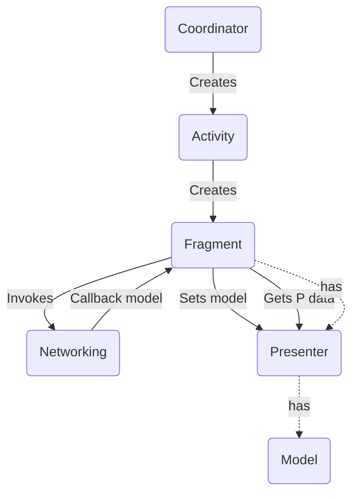

<table style="width:100%; border:none">
  <tr>
    <td>
      
    </td>
    <td>
      
    </td>
    <td>
  
    </td>
  </tr>
</table>

An language feature battle

---

### Why Kotlin?

- Points

---

### Kotlin benefits

- Points

---

---
