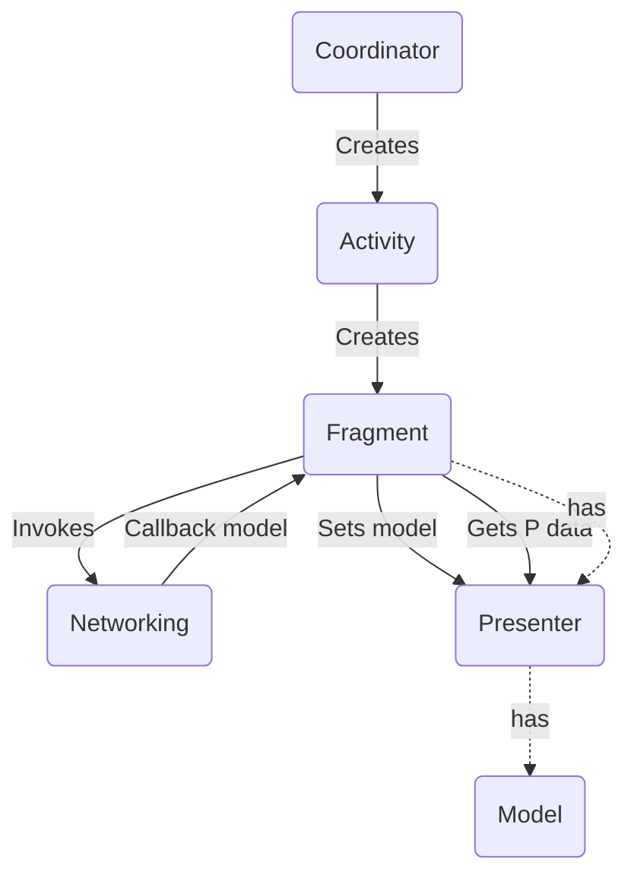

# Kotlin vs Java 8 

An language feature battle

---

### Why Kotlin?

- Points

---

### Kotlin benefits

- Points

---

```mermaid
graph TB
C(Coordinator) -- Creates --> A(Activity)
A -- Creates --> F(Fragment)
F -- Invokes --> N(Networking)
N -- Callback model --> F
F -- Sets model --> P
F -- Gets P data --> P
F -. has .-> P(Presenter)
P -. has .-> M(Model)
```

---
